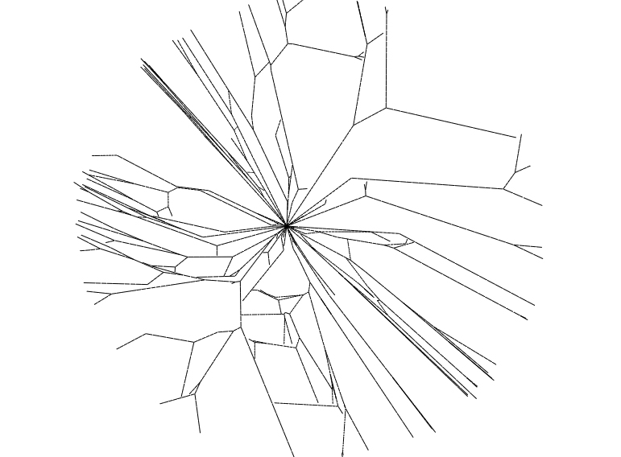
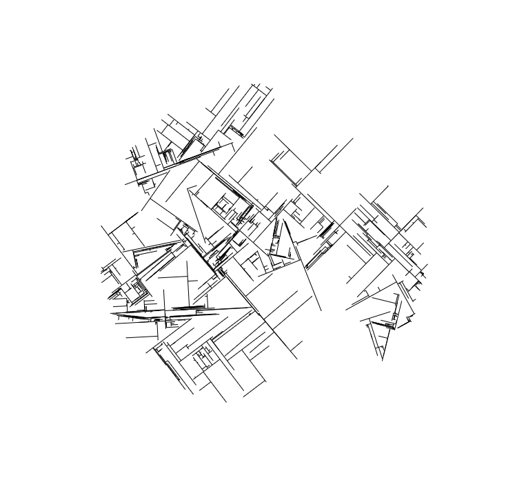

# Canvas Projects Combined

## About

This repository is a collection of previous JavaScript projects I've worked on
that involve interactive, generative visuals or art in some way. Each project
provides setting controls for visitors to play around with and generate new
patterns. The final result can be seen live
[here](https://canvasprojects.imfast.io/index.html).

## Tech

Built primarily with the JavaScript Canvas API and a small amount of HTML and
CSS to provide the settings interface.

## Contact

For questions or comments, or just to say hi, contact me on
[LinkedIn](https://www.linkedin.com/in/austinmtheriot/) or on my
[digital portfolio](https://austintheriot.com).

## Example Images

 

 

 

 

